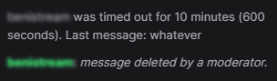

# twitch-timeouts

## Setup

Import or copy-paste contents of [Twitch timeouts.user.js](https://github.com/donthub/twitch-timeouts/blob/main/Twitch%20timeouts.user.js) into the UserScript manager of your choice (e.g. [ViolentMonkey](https://violentmonkey.github.io/)).

## Usage

Timeouts and bans will appear in Twitch chat automatically, along with the user's last message e.g.:

## How does it work?

The userscript creates a WebSocket connection to Twitch IRC servers, logs in as anonymous user to the Twitch channel's IRC channel. For each user, it saves their last message, as well as looks for `CLEARCHAT` messages that are triggered by user timeouts. When found, it prints the user, duration of the timeout and last message to the Twitch chat.
